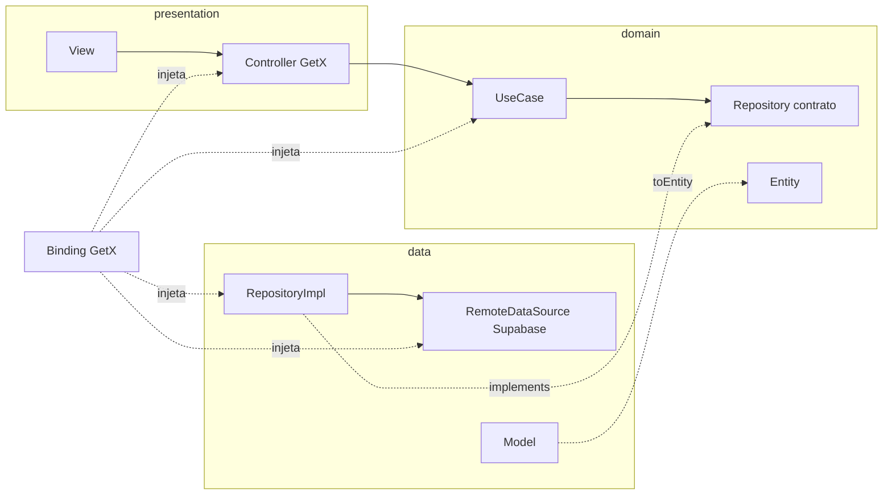

# ADR-0004 — Clean Architecture (organizada por feature)

- **Status:** Aceito
- **Data:** 2026-10-02

## Contexto

O app tem duas "faces" (vitrine pública e admin da Ana) e precisa crescer sem virar um
`lib/` bagunçado. Também precisa favorecer **reaproveitamento**, **testes** e
**independência de framework** (GetX e Supabase não podem contaminar a regra de negócio).

## Decisão

Adotar **Clean Architecture** no Flutter, com as pastas organizadas **por feature**.
Cada feature tem as 3 camadas clássicas:

| Camada | Contém | Depende de |
|---|---|---|
| **domain** | `entities`, `repositories` (contratos abstratos), `usecases` | **nada** (Dart puro) |
| **data** | `datasources` (Supabase), `models` (DTO + `fromJson`/`toJson` + `toEntity`), `repositories` (implementações) | domain |
| **presentation** | `controllers` (GetX), `bindings` (DI GetX), `views`, `widgets` locais | domain |

O GetX entra **apenas** em `presentation` (estado) e `bindings` (injeção) — ver ADR-0003.

### Estrutura

```
lib/
├── main.dart
├── app/
│   ├── routes/            # app_routes.dart (constantes), app_pages.dart (GetPage + Binding)
│   ├── bindings/          # initial_binding.dart (serviços globais)
│   └── middlewares/       # admin_guard.dart
├── core/                  # compartilhado por TODAS as features
│   ├── config/            # env (dart-define), constantes
│   ├── theme/             # tokens pastel, ThemeData light/dark, ThemeController
│   ├── responsive/        # AppResponsive + ResponsivePage (ADR-0010)
│   ├── widgets/           # componentes reutilizáveis (ProductCard, AppButton, PriceText…)
│   ├── services/          # SupabaseService, LocalStorageService, SourceTracker
│   ├── usecase/           # contrato base UseCase<Output, Params>
│   ├── utils/             # currency, whatsapp_message_builder, slug
│   └── errors/            # Failure, exceptions, Result<T>
└── features/
    ├── landing/           # escolha Masculino / Feminino
    ├── catalog/           # grid de produtos + filtros
    ├── product/           # detalhe, seleção tamanho/cor
    ├── cart/              # carrinho (persistido)
    ├── checkout/          # cria pedido + abre WhatsApp
    ├── order/             # página do pedido (/pedido/:code) — pública e admin
    └── admin/             # deferred: auth, products, stock, orders, reports
        └── <feature>/
            ├── data/
            │   ├── datasources/   # *_remote_datasource.dart (Supabase)
            │   ├── models/        # *_model.dart
            │   └── repositories/  # *_repository_impl.dart
            ├── domain/
            │   ├── entities/
            │   ├── repositories/  # contratos abstratos
            │   └── usecases/      # 1 caso de uso = 1 classe = 1 ação
            └── presentation/
                ├── bindings/      # *_binding.dart (Get.lazyPut)
                ├── controllers/   # *_controller.dart (GetxController)
                ├── views/
                └── widgets/
```

### Regra de dependência



As setas de código **sempre apontam para o domain**. O `Binding` é o único lugar que
conhece todas as camadas e as "liga".

### Exemplo — confirmar venda

```dart
// domain/usecases/confirm_order_usecase.dart
class ConfirmOrderUseCase implements UseCase<Order, String> {
  ConfirmOrderUseCase(this._repository);
  final OrderRepository _repository;

  @override
  Future<Result<Order>> call(String code) => _repository.confirm(code);
}

// data/repositories/order_repository_impl.dart
class OrderRepositoryImpl implements OrderRepository {
  OrderRepositoryImpl(this._remote);
  final OrderRemoteDataSource _remote;

  @override
  Future<Result<Order>> confirm(String code) async {
    try {
      final model = await _remote.confirmOrder(code); // supabase.rpc('confirm_order')
      return Success(model.toEntity());
    } on PostgrestException catch (e) {
      return Failed(OrderFailure.fromPostgres(e)); // ex.: insufficient_stock
    }
  }
}

// presentation/bindings/order_binding.dart
class OrderBinding extends Bindings {
  @override
  void dependencies() {
    Get.lazyPut<OrderRemoteDataSource>(() => OrderRemoteDataSourceImpl(Get.find()));
    Get.lazyPut<OrderRepository>(() => OrderRepositoryImpl(Get.find()));
    Get.lazyPut(() => ConfirmOrderUseCase(Get.find()));
    Get.lazyPut(() => OrderController(confirmOrder: Get.find()));
  }
}

// presentation/controllers/order_controller.dart
class OrderController extends GetxController {
  OrderController({required this.confirmOrder});
  final ConfirmOrderUseCase confirmOrder;

  final state = Rx<UiState<Order>>(const UiState.idle());

  Future<void> confirm(String code) async {
    state.value = const UiState.loading();
    final result = await confirmOrder(code);
    state.value = result.fold(UiState.success, UiState.failure);
  }
}
```

### Regras

- `domain` **não importa** Flutter, GetX nem Supabase.
- Controller **só chama use cases** — nunca repositório ou Supabase direto.
- Erros cruzam camadas como `Result<T>` (`Success` / `Failed`) com `Failure` — sem exceção vazando para a View.
- Uma feature **não importa** outra; o que for comum sobe para `core/`.
- **Antes de criar qualquer widget**, verificar `core/widgets/` (regra do projeto).

## Alternativas consideradas

- *Layer-first* (`lib/controllers`, `lib/views`…) — fácil no início, escala mal.
- Estrutura padrão do `get_cli` (`app/modules`) — mistura camadas; não separa domain.
- MVC simples com GetX — rápido, mas acopla regra de negócio ao framework.

## Consequências

- **+** Regra de negócio testável sem Flutter/GetX/Supabase; trocar backend ou gerência de
  estado afeta só `data` ou `presentation`.
- **+** Features isoladas → admin carregado sob demanda (deferred).
- **−** Mais arquivos por funcionalidade (entity + model + contrato + impl + usecase + binding).
  Mitigação: snippets/templates e, se útil, um gerador (`mason`) para criar a feature completa.
