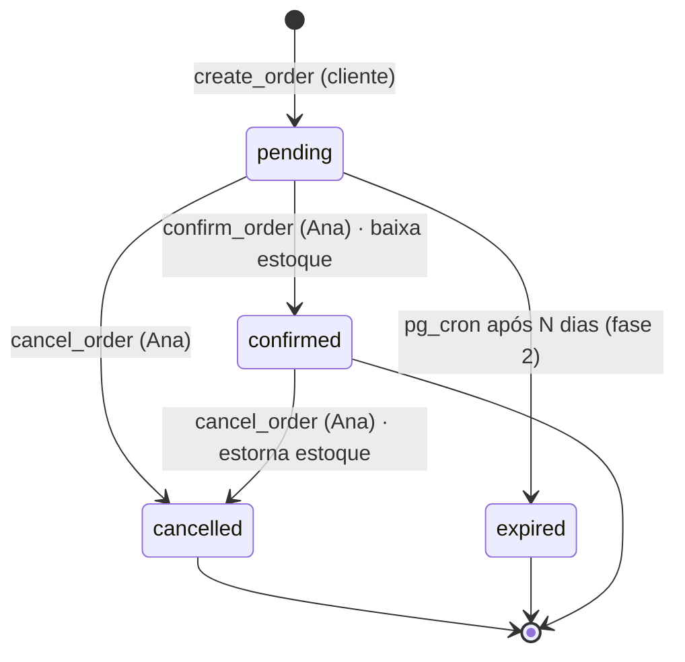

# ADR-0006 — Baixa de estoque na confirmação da venda (RPC transacional)

- **Status:** Aceito
- **Data:** 2026-10-02

## Contexto

O pedido nasce `pending` (ADR-0005), mas a venda só é real quando a Ana fecha com o cliente
no WhatsApp. Se o estoque baixasse na criação, pedidos abandonados "prenderiam" peças.
Requisito: **a Ana acessa o link do pedido para dar baixa**.

## Decisão

- **Estoque só é decrementado quando a Ana confirma** o pedido em `/pedido/:code`
  (logada como admin), via RPC **`confirm_order(p_code)`**.
- A RPC é **atômica e idempotente**:
  1. Verifica `is_admin()`.
  2. `SELECT ... FOR UPDATE` no pedido; só aceita status `pending`.
  3. Para cada item: `UPDATE product_variants SET stock_qty = stock_qty - qty WHERE id = ? AND stock_qty >= qty`.
     Se alguma linha não atualizar → `RAISE EXCEPTION 'insufficient_stock'` e **rollback total**.
  4. Insere `stock_movements` (`reason = 'sale'`, `order_id`).
  5. Marca `status = 'confirmed'`, `confirmed_at`, `confirmed_by`.
- **`cancel_order(p_code)`**: `pending → cancelled` (sem efeito no estoque) ou
  `confirmed → cancelled` (**estorna** o estoque com `reason = 'cancel_return'`).
- Antes de confirmar, a Ana pode **ajustar itens** (cliente trocou o tamanho) — fase 2.
- **Sem reserva** de estoque em pedidos pendentes (volume baixo; simplicidade).

### Máquina de estados

## Alternativas consideradas

| Alternativa | Por que não |
|---|---|
| Baixar na criação do pedido | Pedido abandonado trava estoque. |
| Reserva com expiração | Complexidade desnecessária para o volume da loja. |
| Baixa no front (vários `update`) | Sem atomicidade: falha no meio deixa estoque inconsistente. |

## Consequências

- **+** Estoque sempre consistente; histórico auditável em `stock_movements`.
- **+** Relatório de vendas = pedidos `confirmed` (fonte única).
- **−** Dois clientes podem pedir a última peça; o segundo será avisado pela Ana. Aceito.
  A vitrine mostra "Últimas unidades"/"Esgotado" para reduzir o caso.
