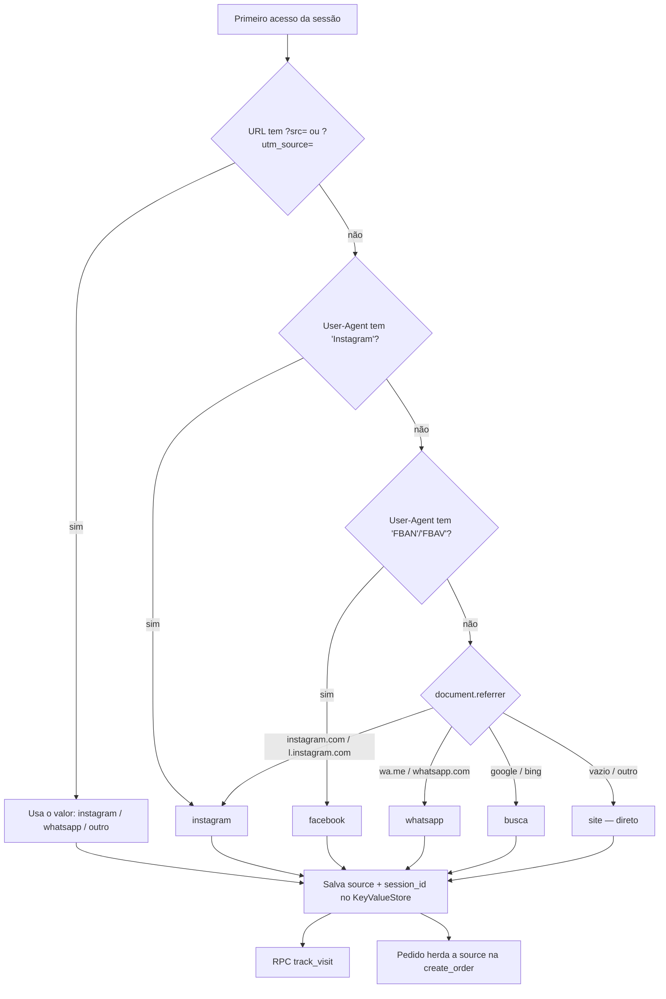

# ADR-0007 — Rastreamento da origem do tráfego (Instagram / WhatsApp / Site)

- **Status:** Aceito
- **Data:** 2026-10-02

## Contexto

A Ana quer saber **por qual plataforma chegam mais clientes**: Instagram, WhatsApp ou site
(acesso direto / Google / outros). Navegadores não informam isso de forma confiável sozinhos:
o `document.referrer` costuma vir vazio em apps, e o WhatsApp abre links no navegador externo.

## Decisão

Detecção em camadas, da mais confiável para a menos, implementada em `core/services/source_tracker.dart`:

### Links oficiais (o pulo do gato)

A Ana usa **links diferentes por canal** — é isso que dá precisão:

| Canal | Link |
|---|---|
| Bio do Instagram | `https://<dominio>/?src=instagram` |
| Stories / posts | `https://<dominio>/?src=instagram&utm_campaign=<campanha>` |
| WhatsApp (status, listas, grupos) | `https://<dominio>/?src=whatsapp` |
| Cartão / QR code físico | `https://<dominio>/?src=qrcode` |

O admin terá um **"Gerador de links"** que copia essas URLs prontas.

### Regras

- Origem é definida **uma vez por sessão** (first-touch) e não é sobrescrita na navegação interna.
- `session_id` = UUID anônimo gerado no navegador. **Nenhum dado pessoal** é coletado (LGPD).
- `track_visit` é chamada 1x por sessão (não por página) para não inflar a base.

## Alternativas consideradas

| Alternativa | Por que não |
|---|---|
| Google Analytics / Meta Pixel | Útil, mas exige banner de cookies e não cruza com **pedidos** no nosso banco. Pode ser somado depois. |
| Só `document.referrer` | Vem vazio na maioria dos acessos via app. |

## Consequências

- **+** Relatório "visitas × pedidos × vendas por origem" (conversão por canal) direto do Postgres.
- **−** Quem copiar o link sem `?src=` cai em "site". Mitigação: Ana sempre usa o gerador de links.
- **−** Detecção por User-Agent pode mudar com versões do app; por isso o parâmetro `src` tem prioridade.
