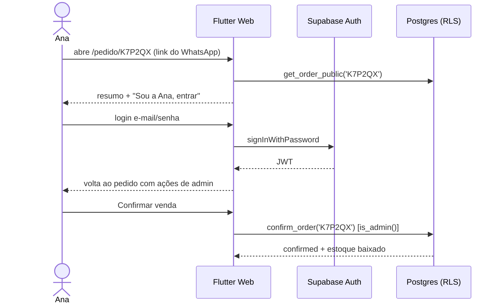

# ADR-0011 — Autenticação da área administrativa

- **Status:** Aceito
- **Data:** 2026-10-02

## Contexto

Só a Ana (e eventualmente uma ajudante) acessa o admin. Clientes **não** têm conta.
O mesmo link `/pedido/:code` é aberto por cliente (visualização) e pela Ana (ações).

## Decisão

- **Supabase Auth com e-mail + senha** para admins. Cadastro público **desabilitado**
  (`enable_signup = false`); usuárias criadas manualmente pelo Studio/CLI.
- Tabela **`admin_users (user_id uuid pk references auth.users)`** + função
  `is_admin()` (`security definer`) usada em todas as policies e RPCs.
- Rotas `/admin/**` protegidas pelo `AdminGuard` (`GetMiddleware`) — o guard é **UX**;
  a **segurança real é o RLS** no banco.
- Página `/pedido/:code`:
  - **Visitante:** resumo do pedido via RPC `get_order_public(code)` (itens, total, status — sem dados internos).
  - **Admin logada:** mesma página com botões **Confirmar venda** / **Cancelar** / **Editar itens**.
  - Se a Ana abrir o link deslogada → botão "Sou a Ana, entrar" → login → volta ao pedido.
- Sessão persistida pelo `supabase_flutter` (refresh token automático).

## Alternativas consideradas

- *Magic link por e-mail* — sem senha, mas no in-app browser do WhatsApp/Instagram o link
  do e-mail abre em outro navegador e "perde" a sessão. Pode ser opção extra.
- *Senha fixa no front* — inseguro.

## Consequências

- **+** Simples, seguro pelo RLS, sem cadastro de cliente (menos LGPD).
- **−** Recuperação de senha depende de SMTP configurado no Supabase (configurar antes da produção).
