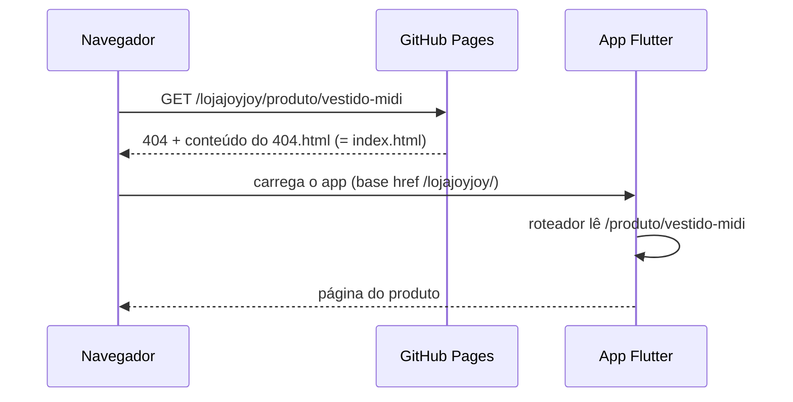

# ADR-0013 — CI no GitHub Actions e hospedagem temporária no GitHub Pages

- **Status:** Aceito
- **Data:** 2026-10-05
- **Relaciona:** ADR-0012 (Vercel, segue *Proposto* para o go-live)

## Contexto

Precisamos de CI desde já (todo PR passa por format, analyze, testes, pgTAP) e de uma URL pública
para mostrar a vitrine antes de decidir a hospedagem final. O repositório já está no GitHub.

## Decisão

Três workflows em `.github/workflows/`:

| Workflow | Quando | O que faz |
|---|---|---|
| `ci.yml` | todo push e PR | `dart format` (falha se não formatado), `flutter analyze`, `flutter test`, build `--wasm` |
| `database.yml` | push/PR que mexe em `supabase/`, `lib/**/data/` ou `test/integration/` | sobe o Supabase local no runner, aplica migrations + seed, `supabase test db` (pgTAP) e os testes de integração do app |
| `deploy-pages.yml` | push na `main` ou manual | build `--wasm` com `--base-href` do Pages, `404.html` = `index.html`, publica no GitHub Pages |

- Flutter do CI = versão do `.fvmrc` (mesma do FVM local).
- `SUPABASE_URL` / `SUPABASE_ANON_KEY` do deploy vêm de **Variables** do repositório (a chave anon é
  pública por natureza; a segurança é o RLS). Sem elas, o site abre em "Configuração ausente".
- Permissões mínimas: `contents: read` (CI); `pages: write` + `id-token: write` só no deploy.

### Rotas da SPA no Pages

## Consequências

- **+** CI barra PR com teste quebrado, código sem formatar ou RLS quebrado (pgTAP).
- **+** URL pública grátis para mostrar à Ana enquanto a hospedagem final não é decidida.
- **−** Links diretos respondem **HTTP 404** (o conteúdo é o app correto). Alguns robôs de preview de link
  (WhatsApp/Instagram) podem ignorar páginas 404 → o preview do link **da home** funciona; de páginas
  internas pode falhar. Resolvido no go-live com rewrite real (Vercel/Cloudflare — ADR-0012).
- **−** Subcaminho `/lojajoyjoy/` até ter domínio próprio.
- **−** Precisa do Supabase na nuvem (PR-11) para o site ter dados; até lá mostra "Configuração ausente".
