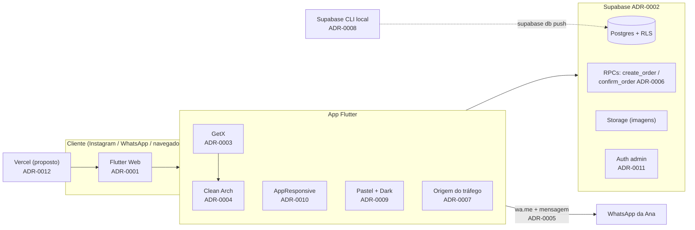

# ADRs — JOYJOY (lojajoyjoy)

> Architecture Decision Records. Cada decisão relevante vira um arquivo numerado,
> imutável depois de **Aceito** (se mudar, cria-se um novo ADR que *substitui* o anterior).

## Formato

`NNNN-titulo-em-kebab.md` com as seções: **Status · Contexto · Decisão · Alternativas · Consequências**.

Status possíveis: `Proposto` → `Aceito` → (`Substituído por ADR-XXXX` | `Descontinuado`).

## Índice

| #    | Decisão                                                         | Status    |
|------|-----------------------------------------------------------------|-----------|
| 0001 | [Flutter Web como plataforma do site](0001-flutter-web.md)       | Aceito    |
| 0002 | [Supabase como backend (BaaS)](0002-supabase-backend.md)         | Aceito    |
| 0003 | [GetX para estado, DI e rotas](0003-getx-estado-di-rotas.md)     | Aceito    |
| 0004 | [Clean Architecture organizada por feature](0004-clean-architecture.md) | Aceito |
| 0005 | [Checkout finalizado no WhatsApp com pedido registrado](0005-checkout-whatsapp.md) | Aceito |
| 0006 | [Baixa de estoque na confirmação da venda (RPC transacional)](0006-baixa-estoque-confirmacao.md) | Aceito |
| 0007 | [Rastreamento da origem do tráfego (Instagram / WhatsApp / Site)](0007-rastreamento-origem.md) | Aceito |
| 0008 | [Ambiente local com Supabase CLI (Postgres) e migrations versionadas](0008-ambiente-local-migrations.md) | Aceito |
| 0009 | [Design system em tons pastéis com modo escuro](0009-design-system-pastel-dark.md) | Aceito |
| 0010 | [Classe única de responsividade `AppResponsive`](0010-responsividade-app-responsive.md) | Aceito |
| 0011 | [Autenticação da área administrativa](0011-autenticacao-admin.md) | Aceito    |
| 0012 | [Hospedagem do front-end (Vercel)](0012-hospedagem-vercel.md)    | Proposto  |

## Visão geral das decisões

