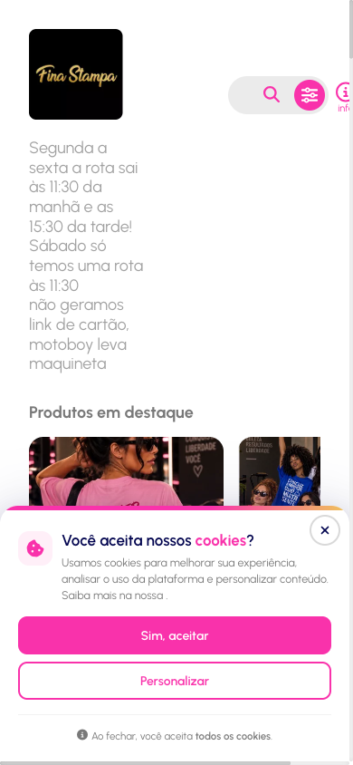
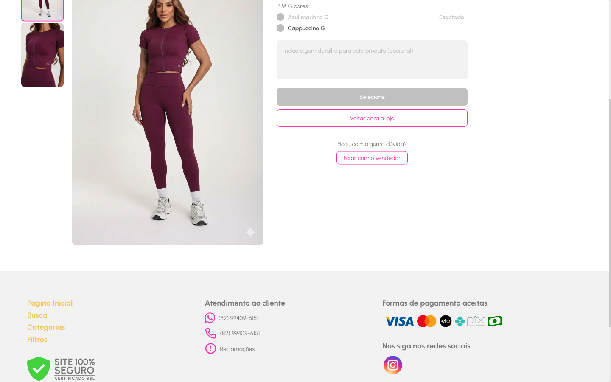
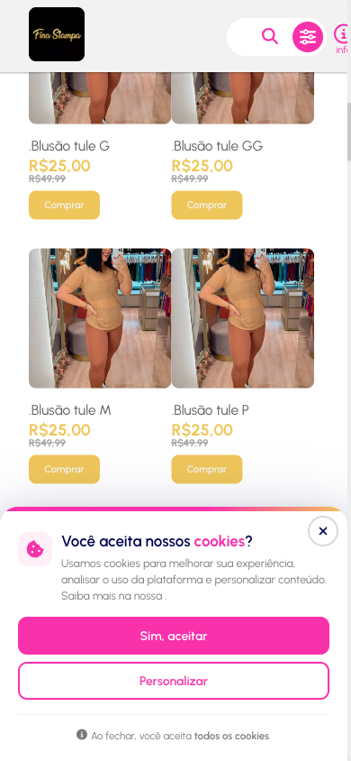
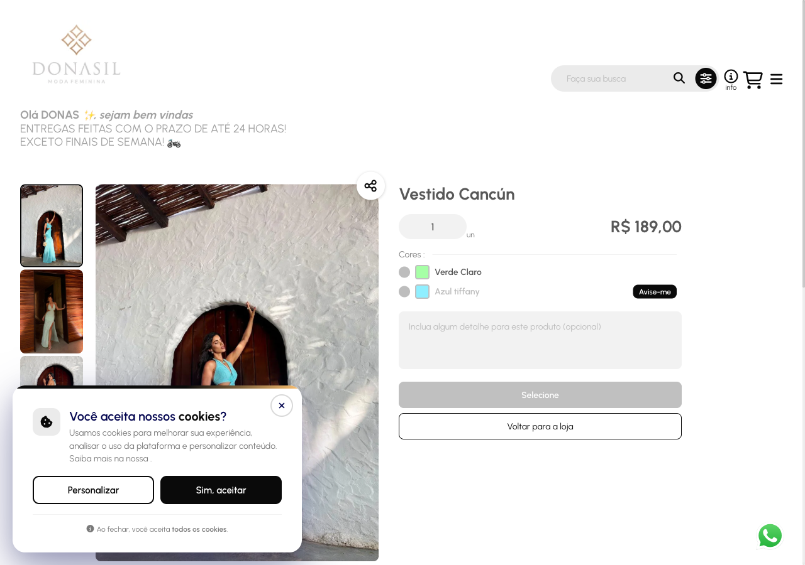
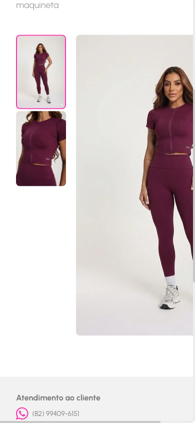
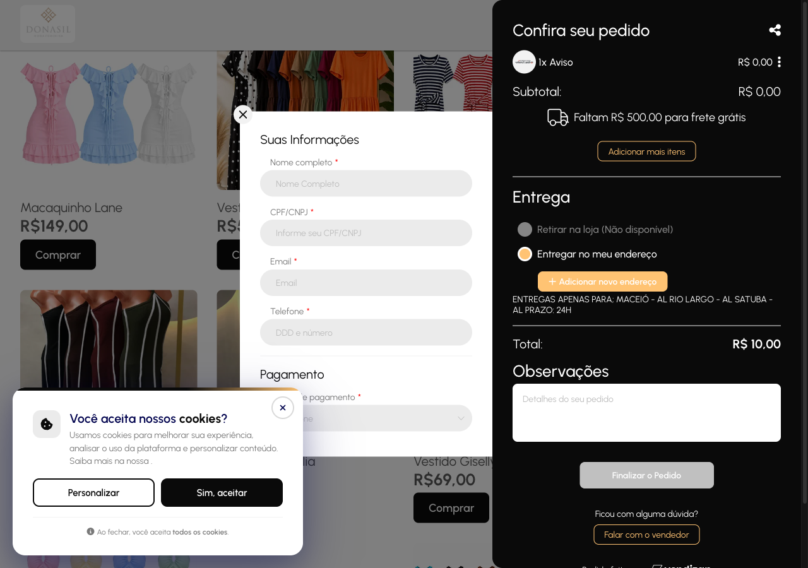
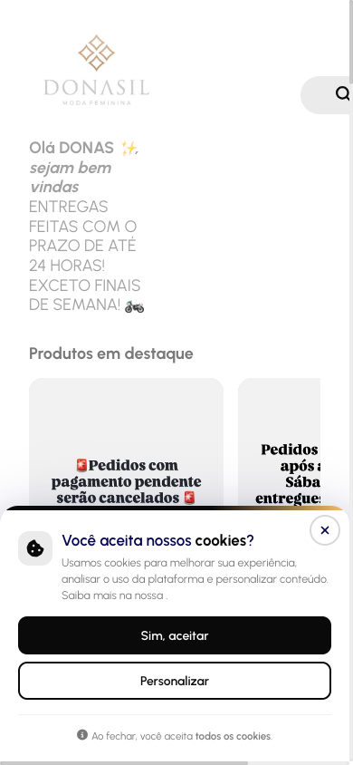
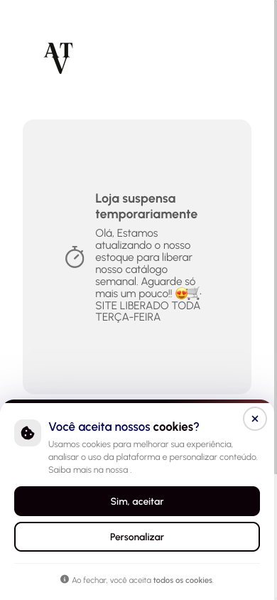
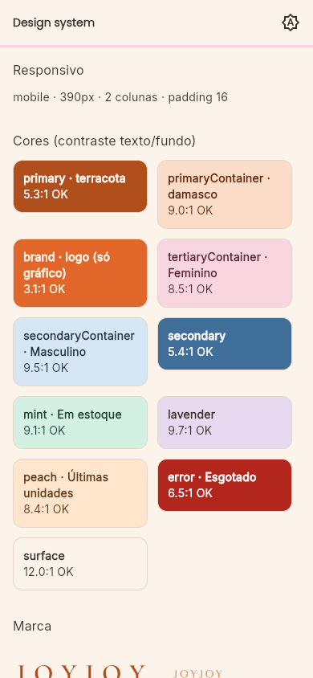
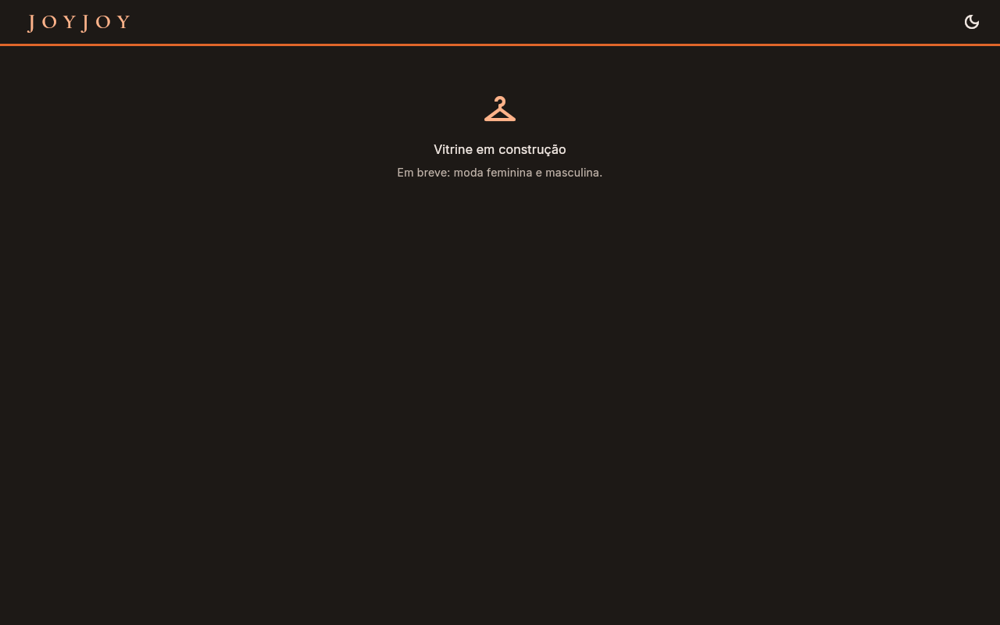

# Referências visuais e de UX

> Substitui o Figma (decisão: não teremos Figma). Prints tirados em **2026-10-02** via Playwright MCP,
> em **390×844** (celular) e **1280/1440** (desktop).

| Loja | URL | Observação |
|---|---|---|
| Fina Stampa | https://finastampa1.vendizap.com/ | Moda feminina, Maceió |
| Donasil | https://lojasdonasil.vendizap.com/ | Moda feminina, Maceió |
| Atrativa Clothing | https://atrativaclothing-oficial.vendizap.com/ | Estava **suspensa temporariamente** no dia |

> As três lojas usam o **Vendizap** (SaaS de catálogo com pedido pelo WhatsApp). É exatamente o
> modelo da Ana, ou seja, são as concorrentes diretas. A ideia é **copiar o que funciona e corrigir o que irrita**.

---

## 1. Prints

| Celular | Desktop |
|---|---|
|  |  |
|  |  |
|  |  |
|  | |
|  | |

---

## 2. O que vamos adotar ✅

| # | Padrão | Onde vimos | Como fica na nossa loja |
|---|---|---|---|
| A1 | Header com **logo + busca + carrinho com badge** | Todas | `AppHeader` (core/widgets) |
| A2 | **Recado da loja** no topo (horário de entrega, pagamento) | Fina Stampa, Donasil | Campo `announcement` em `store_settings`, editável pela Ana |
| A3 | **Destaques** em carrossel horizontal + **chips de categoria** + grid de 2 colunas no celular | Todas | Landing/Catálogo; `AppResponsive.gridColumns` |
| A4 | Botão **"Comprar"** no card e **preço promocional riscado** | Todas | `compare_at_price` no produto; `PriceText` com o "de/por" |
| A5 | **Ordenação** (novidades, preço) | Todas | RF-03 |
| A6 | Variantes em lista com **"Esgotado"** e **amostra de cor** | Fina Stampa, Donasil | `ColorSelector` com `color_hex`, `SizeSelector` com esgotados desabilitados |
| A7 | **Observação por item** ("incluir algum detalhe", opcional) | Ambas | Campo `note` em `order_items`, sai na mensagem do WhatsApp |
| A8 | **"Avise-me"** em produto esgotado | Donasil | Abre o WhatsApp da Ana com "Me avise quando chegar *X* tam. *M*" (sem gravar nada) |
| A9 | Carrinho em **painel lateral** no desktop (tela cheia no celular) | Donasil | `CartView` via `r.value(mobile: página, desktop: drawer)` |
| A10 | **Entrega: retirar ou entregar** no checkout | Donasil | Campo opcional, sai na mensagem |
| A11 | **Forma de pagamento** preferida | Donasil | Pix / cartão / dinheiro, opcional, sai na mensagem |
| A12 | **Botão flutuante do WhatsApp** ("Falar com a vendedora") | Donasil | `WhatsAppFab` |
| A13 | **Compartilhar produto** | Donasil | Copia o link `/produto/:slug?src=whatsapp` |
| A14 | **Loja fechada temporariamente** com mensagem | Atrativa | `store_settings.is_open` + `closed_message`. A vitrine mostra o aviso e bloqueia o checkout |
| A15 | Rodapé com atendimento, redes e formas de pagamento | Todas | `AppFooter` |
| A16 | Barra **"faltam R$ X para frete grátis"** | Donasil | Configurável. **Incremento 2** |

## 3. O que vamos evitar ❌

| # | Problema encontrado | Evidência | Nossa resposta |
|---|---|---|---|
| E1 | **Um produto para cada tamanho** ("Blusão tule G", "Blusão tule GG", "… M", "… P") | Grid da Fina Stampa | Produto único com **variantes tamanho × cor** (já no modelo de dados) |
| E2 | **Página de produto quebrada no celular**: informações e botão ficam fora da tela (largura 464px num viewport de 390) | `finastampa-mobile-produto-info.png` | `ResponsivePage` + **teste de widget sem overflow** em 390px em toda tela |
| E3 | **Banner de cookies** gigante cobrindo metade da tela na primeira visita | Todas | Não usamos cookies de terceiros, então não precisamos do banner. Só um link de privacidade no rodapé |
| E4 | **Checkout pesado**: nome, CPF, e-mail e telefone obrigatórios | `donasil-desktop-carrinho.png` | Só nome (opcional), entrega e pagamento. O telefone já vem pelo WhatsApp |
| E5 | **Aviso cadastrado como produto** de R$ 0,00 que dá para pôr no carrinho (aconteceu no teste) | Carrinho da Donasil com "1x Aviso R$ 0,00" | Avisos e banners são **entidades separadas** de produto |
| E6 | Grid com **paginação de 9 páginas** | Fina Stampa | Rolagem infinita com carregamento progressivo + filtros |
| E7 | Recado em CAIXA ALTA, em coluna estreita e difícil de ler | Donasil, Fina Stampa | Recado em card pastel, largura total, tipografia normal |
| E8 | Logo e textos sem hierarquia (recado empurra os produtos para baixo da dobra) | Fina Stampa | Recado compacto (máx. 2 linhas, "ver mais") e produtos visíveis já na primeira tela |

---

## 4. Impacto no escopo — ✅ aprovado pelo Diogo em 2026-10-02

Itens pequenos que valem entrar **já no MVP de validação**, porque a concorrência tem:

| Item | Custo | Proposta |
|---|---|---|
| A2 Recado da loja | Baixo | MVP (PR-03 + PR-04) |
| A4 Preço promocional riscado | Baixo | MVP (PR-03 + PR-04) |
| A7 Observação por item | Baixo | MVP (PR-05 + PR-07) |
| A8 Avise-me | Baixo | MVP (PR-05) |
| A10/A11 Entrega e pagamento no checkout | Baixo | MVP (PR-07) |
| A12 Botão flutuante do WhatsApp | Baixo | MVP (PR-04) |
| A14 Loja fechada temporariamente | Baixo | MVP (PR-03 + PR-07) |
| A13 Compartilhar produto | Baixo | Incremento 2 |
| A16 Barra de frete grátis | Médio | Incremento 2 |

## 5. Direção visual (nossa)

- As referências são **escuras, neutras ou rosa-choque**. A Ana vai se diferenciar com **tons pastéis** (ADR-0009).
- Cards com cantos de raio 16, foto ocupando ~70% do card, preço em destaque, botão "Comprar" pastel com texto escuro (contraste AA).
- Seções: **Feminino = rosa pastel**, **Masculino = azul bebê** (acento no header e nos chips).

## 6. Design system implementado (PR-02)

Para validar: `fvm flutter run -d chrome` e abrir **`/design`** (rota só em debug).

| Celular · claro | Desktop · escuro |
|---|---|
|  |  |
