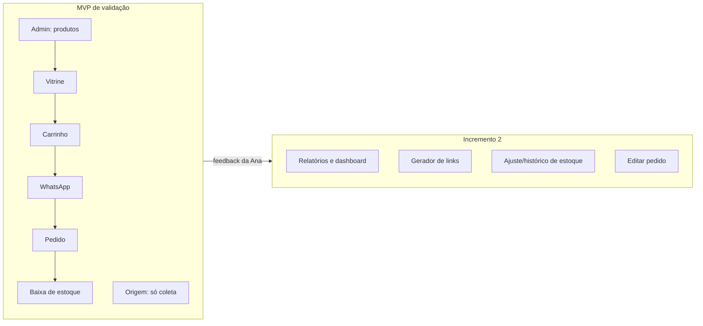
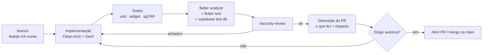
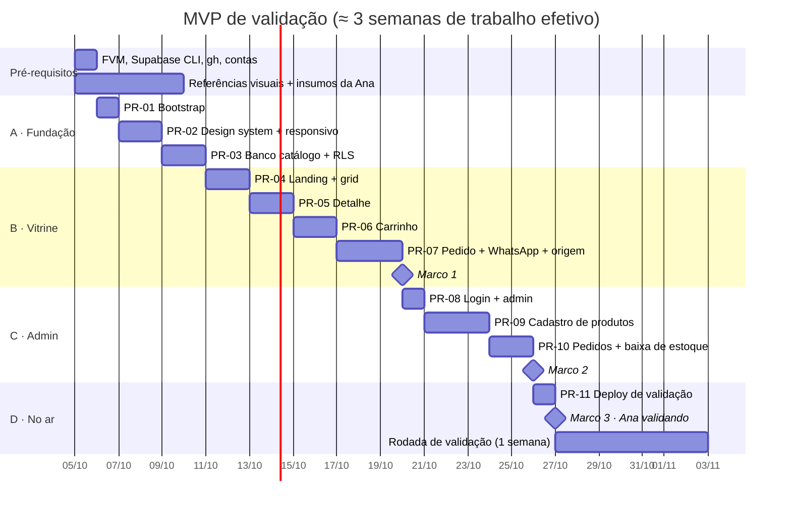

# Plano de Execução — MVP de Validação com a Ana

> **Objetivo:** colocar no ar, o quanto antes, uma versão **usável de ponta a ponta** para a Ana
> validar no celular dela: cliente escolhe roupa → carrinho → pedido chega no WhatsApp da Ana →
> Ana abre o link e dá baixa no estoque.
>
> - **Base:** [SDD](../sdd/SDD.md) · [ADRs](../adr/README.md)
> - **Data:** 2026-10-02 · **Versão:** 1.0
> - **WhatsApp da Ana:** `+55 81 98632-3686` → formato `wa.me`: `5581986323686`

---

## 1. Escopo da validação (MVP)

### 1.1 O que entra

| # | Funcionalidade | Por que entra na validação |
|---|---|---|
| 1 | Landing **Feminino / Masculino** | Primeira impressão da marca |
| 2 | **Grid** de produtos por seção (com selo Esgotado / Últimas unidades) | Núcleo da vitrine |
| 3 | **Detalhe** do produto: fotos, descrição, tamanho, cor, quantidade | Valida a escolha de variantes |
| 4 | **Carrinho** com várias peças (persistido no navegador) | Requisito central |
| 5 | **Finalizar no WhatsApp** com a mensagem pronta para `5581986323686` | É o "caixa" da loja |
| 6 | Página do **pedido** `/pedido/:code` | Link que vai na mensagem |
| 7 | **Login da Ana** + cadastro de produtos (fotos, descrição, tamanhos, cores, estoque) | Ana precisa cadastrar as próprias peças |
| 8 | **Confirmar venda / Cancelar** no link do pedido → **baixa de estoque** | Requisito central de estoque |
| 9 | Lista de pedidos (pendentes / confirmados) | Para ela achar os pedidos |
| 10 | Captura da **origem** (`?src=instagram` / `whatsapp`) — só grava, sem tela | Começar a coletar dados desde o 1º dia |
| 11 | Tema **pastel claro/escuro** + responsivo celular → desktop | Requisito de UX |

### 1.2 O que fica para depois da validação (Incremento 2)

| Funcionalidade | Motivo de adiar |
|---|---|
| Dashboard de **relatórios** (vendas, ticket, top produtos, origem × conversão) | Precisa de dados reais; os dados já vão sendo coletados desde o MVP |
| Gerador de links por canal | A Ana usa os 2 links prontos que entregaremos |
| Ajuste manual de estoque + histórico | No MVP o estoque é editado no cadastro do produto |
| Editar itens de um pedido pendente | No MVP: cancelar e o cliente refaz o pedido |
| Filtros avançados, expiração de pedidos, CSV | Refinamento |

---

## 2. Pré-requisitos (antes do PR-01)

### 2.1 Ambiente do Diogo

| Item | Situação hoje | Ação |
|---|---|---|
| Flutter | ✅ **3.44.9** via FVM 4.0.5 (`.fvmrc`). O global continua 3.19.6 para os outros projetos | — |
| Docker | ✅ 29.4.1 | Manter o Docker Desktop rodando |
| Supabase CLI | ✅ 2.119.0 | — |
| GitHub CLI (`gh`) | ❌ | `brew install gh && gh auth login` (para abrir PRs, **sempre com sua permissão**) |
| Vercel CLI | ❌ | Só no PR-11 (`npm i -g vercel`) |
| Repo | ✅ `github.com/PimentelDiogo/lojajoyjoy` | Proteger a `main` (merge só via PR) |

### 2.2 Contas

- [ ] Projeto no **Supabase** (free, para validação). Região **São Paulo** (`sa-east-1`).
- [ ] Conta **Vercel** ligada ao GitHub (decisão final do ADR-0012 no PR-11).

### 2.3 Insumos da Ana (pedir já, em paralelo ao desenvolvimento)

- [x] **Logo** recebida (2026-10-02): círculo creme `#FCF3EA` com "JOYJOY" em laranja terracota. Aplicada no favicon, nos ícones do PWA, no header, no splash e no `og:image`.
- [ ] **10 a 15 peças reais** para a validação (5+ femininas e 5+ masculinas): fotos, nome, descrição, preço, tamanhos, cores e quantidade.
- [ ] **Tabela de tamanhos** que ela usa (PP–GG? 36–48? depende da peça?).
- [ ] Mostrar ao cliente a **quantidade exata** em estoque ou só "Últimas unidades"?
- [x] Login de admin **(provisório)**: `ana@joyjoy.com.br`. A senha provisória fica só no seed local (PR-03); **na nuvem (PR-11) usar outra senha forte**.

### 2.4 Referências visuais (no lugar do Figma)

Como não teremos Figma, o design nasce **de referências de lojas existentes** e evolui junto com a gente:

1. Diogo e Ana listam **3 a 5 lojas de referência** (sites ou Instagram) de que gostam.
2. Eu analiso as referências (via **Playwright MCP**: screenshots em mobile e desktop) e extraio
   padrões: layout da landing, card de produto, seletor de tamanho/cor, carrinho.
3. Registramos os padrões escolhidos em `docs/design/referencias.md` (com prints) e atualizamos
   os tokens do ADR-0009.
4. A cada PR de tela, você valida o visual pelo `flutter run` antes de seguirmos.

---

## 3. Fluxo de trabalho de cada PR

### Definition of Done (vale para todo PR)

- [ ] Segue a Clean Architecture (ADR-0004): `domain` puro, GetX só em `presentation`/`bindings`.
- [ ] Telas usam `ResponsivePage` + `context.responsive` e foram verificadas em **390 / 820 / 1440 px**.
- [ ] Cores só via tokens; telas funcionando em **claro e escuro**.
- [ ] Nenhum widget duplicado (procurei em `core/widgets` antes de criar).
- [ ] Testes escritos e verdes. **Código sem teste só sobe com a sua autorização.**
- [ ] `flutter analyze` sem warnings.
- [ ] **`/security-review` executado** e achados resolvidos ou justificados no PR.
- [ ] Mocks de dado identificados, com o motivo.
- [ ] **PR aberto só com a sua permissão.**

---

## 4. PRs do MVP

> Cada PR é pequeno o bastante para revisar de uma vez. As estimativas são de trabalho efetivo.

### Bloco A — Fundação

#### PR-01 · Bootstrap do projeto (1 dia) — ✅ concluído (branch `feat/pr-01-bootstrap`)
- `flutter create --platforms=web` com FVM; `pubspec` com `get`, `shared_preferences`, `supabase_flutter`,
  `url_launcher`, `cached_network_image`, `google_fonts`, `intl`, `equatable`, `uuid`; dev: `mocktail`, `very_good_analysis`.
- Estrutura Clean Arch (`app/`, `core/`, `features/`) conforme ADR-0004.
- `core/errors` (`Failure`, `Result<T>`), `core/usecase/UseCase`, `core/config/Env` (`--dart-define-from-file`).
- `GetMaterialApp` + `AppPages`/`AppRoutes` + `InitialBinding` + `usePathUrlStrategy()`.
- `web/index.html`: splash em HTML, Open Graph, título "JOYJOY".
- **Testes:** `Result`, `Env`, smoke test do app.
- **Achado:** o GetX resolve rotas como árvore de prefixos, então URLs desconhecidas abriam a landing em vez do 404.
  Corrigido com `StrictRouteMiddleware` (correspondência exata), aplicado a toda página via `AppPages._page`.

#### PR-02 · Design system + responsividade (1,5 dia) — ✅ concluído (marca JOYJOY + terracota)
- `core/theme`: `AppColors` (pastel light/dark), `AppTypography`, `AppSpacing`, `AppTheme`, `ThemeController` (sistema/claro/escuro persistido).
- `core/responsive`: `AppResponsive`, `context.responsive`, `ResponsivePage`, `ResponsiveBuilder`.
- Widgets base: `AppButton`, `PriceText`, `EmptyState`, `ErrorState`, `LoadingSkeleton`, `ThemeToggle`, `AppHeader`.
- **Testes:** breakpoints (599/600, 1023/1024), `value()` com herança, `ThemeController`, widgets base nos 3 tamanhos.
- **Extras:** teste automático de contraste AA da paleta (o primary claro foi ajustado de `#B8577A`, que dava 4.48:1, para `#A94E72`, que dá 5.2:1);
  vitrine **`/design`** (só em debug) no lugar do Figma: cores com contraste, tipografia, botões, preços, estados e grid.

#### PR-03 · Banco local: catálogo + RLS (1,5 dia) — ✅ concluído
- `supabase init`; migrations: enums, `categories`, `products`, `product_images`, `product_variants`, `store_settings`, `admin_users`, `is_admin()`.
- RLS: anônimo lê só o que está ativo; admin tem CRUD.
- Bucket `product-images` com as policies.
- `store_settings` com `store_name = 'JOYJOY'` e `whatsapp_number = '5581986323686'`.
- `seed.sql` — **mock**. Motivo: desenvolver a vitrine antes de a Ana cadastrar as peças reais. Só roda localmente.
  Inclui a usuária admin local `ana@joyjoy.com.br` (senha provisória de dev) em `auth.users` + `admin_users`.
- **Testes pgTAP:** anônimo não vê produto inativo, anônimo não escreve, admin escreve.
- **Entregue:** 4 migrations, seed fictício (7 produtos ativos + 1 inativo, 20 variantes, Ana admin),
  34 testes pgTAP (RLS nos 3 papéis, constraints, storage, path traversal). Verificado via REST:
  login da Ana ok, cadastro público bloqueado.
- **Achado:** `[auth.email] enable_signup = false` desliga o login por e-mail inteiro; o bloqueio de cadastro
  é só o `[auth] enable_signup = false`.

### Bloco B — Vitrine

#### PR-04 · Landing + grid do catálogo (2 dias) — ✅ concluído
- `features/landing` e `features/catalog` completas (datasource → repo → use cases → controller → view).
- Landing com dois blocos (celular: empilhados; desktop: lado a lado).
- Grid com `ProductCard`, `StockBadge`, filtro por categoria e ordenação.
- **Testes:** use cases, `CatalogController` (loading/empty/erro/sucesso), widget dos 3 tamanhos.
- **Entregue:** landing (recado, loja fechada, Feminino/Masculino, destaques), grid com chips de categoria,
  ordenação, carregamento progressivo, selos Esgotado/Últimas unidades/-%, botão flutuante do WhatsApp.
  173 testes + 8 de integração contra o Supabase local. Security review sem achados.

#### PR-05 · Detalhe do produto (1,5 dia) — ✅ concluído
- Galeria (carrossel no celular), `SizeSelector`, `ColorSelector`, `QuantityStepper` limitado ao estoque.
- Combinações sem estoque desabilitadas.
- **Testes:** `ProductDetailController` (seleção válida/inválida, limite de estoque).
- **Entregue:** `/produto/:slug` com galeria (carrossel no celular, miniaturas no desktop), cor → tamanho →
  quantidade (até o estoque, máx. 10), preço por variante, "Última unidade", **Avise-me** pelo WhatsApp em
  combinação esgotada (A8) e "Peça não encontrada". O botão "Adicionar ao carrinho" só avisa "em breve"
  até o PR-06. 206 testes + 10 de integração. Security review sem achados.

#### PR-06 · Carrinho (1,5 dia) — ✅ concluído
- `CartController` global + `CartRepository` local (`KeyValueStore`).
- Soma itens iguais, edita quantidade, remove, mostra total; badge no header.
- **Testes:** regras do carrinho e persistência.
- **Entregue:** `Cart` no domain (soma variante igual, limite de estoque e 10/item, 20 itens, nota ≤ 140),
  persistido em `cart_v1` (JSON corrompido → vazio; regras reaplicadas ao carregar), ícone com contador no
  header, `/carrinho` (lista + barra fixa no celular / resumo ao lado no desktop), observação por item (A7),
  remover com "Desfazer", loja fechada bloqueia o finalizar (A14). "Finalizar no WhatsApp" envia no PR-07.
  Tema: campos de formulário com rótulo dentro do campo. 234 testes. Security review sem achados.

#### CI/CD · GitHub Actions + GitHub Pages — ✅ concluído (ADR-0013)
- PR-01 a PR-06 mergeados na `main` (merge `--no-ff` por PR) em 2026-10-05. CI, Database e Deploy verdes na `main`.
- Site: https://pimenteldiogo.github.io/lojajoyjoy/ — aguardando o Supabase na nuvem (Variables) para ter dados.

#### PR-07 · Pedido + WhatsApp + origem (2,5 dias)
- Migrations: `orders`, `order_items`, `visits`, `generate_order_code()`.
- RPCs: `create_order` (valida estoque, preço do servidor, limites, rate limit), `get_order_public`, `track_visit`.
- `SourceTracker` (`src`/UTM → navegador → página de origem), uma vez por sessão.
- `WhatsAppMessageBuilder` + checkout (nome e observação opcionais) → `wa.me/5581986323686`.
- Página pública `/pedido/:code`.
- **Testes:** builder (formato, BRL, acentos, emoji, URL encode), `SourceTracker`, `CheckoutController`; pgTAP do `create_order` (preço forjado ignorado, estoque insuficiente, rate limit).

> 🎯 **Marco 1 — vitrine completa local.** Você testa o fluxo do cliente no celular (rede local) e manda um pedido de teste para o WhatsApp da Ana.

### Bloco C — Admin

#### PR-08 · Login da Ana + área admin (1 dia)
- `features/admin/auth`: `SignIn`, `SignOut`, `GetCurrentAdmin`; `AuthController` global.
- `AdminGuard` (`GetMiddleware`) em `/admin/**`; módulo admin com **deferred loading**.
- Layout admin responsivo (Drawer no celular, NavigationRail no desktop).
- **Testes:** `AuthController`, comportamento do guard.

#### PR-09 · Cadastro de produtos (3 dias)
- Lista de produtos (busca, ativo/inativo).
- Formulário: nome, descrição, seção, categoria, preço, destaque.
- Upload de **várias fotos** com compressão no cliente, reordenar, definir capa.
- Grade **tamanho × cor** (cor com nome + hex), estoque por variante.
- **Testes:** `SaveProductUseCase`, validações do form, `ProductFormController`; pgTAP do storage (anônimo não faz upload).

#### PR-10 · Pedidos + baixa de estoque (2 dias)
- RPCs `confirm_order` / `cancel_order` + migration `stock_movements`.
- Em `/pedido/:code` logada: botões **Confirmar venda** e **Cancelar**; deslogada: "Sou a Ana, entrar".
- `/admin/pedidos`: lista com filtro por status.
- **Testes:** `OrderController`; pgTAP: baixa atômica, rollback quando falta estoque, idempotência, estorno no cancelamento, não-admin bloqueado.

> 🎯 **Marco 2 — fluxo completo local.** Cliente → WhatsApp → Ana confirma → estoque baixa.

### Bloco D — No ar para a Ana

#### PR-11 · Deploy de validação (1 dia)
- Supabase cloud: `supabase link` + `db push` (sem seed), criar a usuária da Ana, SMTP para recuperar senha.
- Decidir o ADR-0012 (Vercel recomendado) → `vercel.json` com rewrite SPA + cache.
- GitHub Actions: `flutter test` → `flutter build web --release --wasm` → deploy.
- URL de validação (`*.vercel.app` até ter domínio).
- Testes manuais no **in-app browser do Instagram e do WhatsApp** (iOS e Android).
- **Entrega para a Ana:** URL + login + os 2 links oficiais:
  - Bio do Instagram: `https://<url>/?src=instagram`
  - WhatsApp: `https://<url>/?src=whatsapp`

> 🎯 **Marco 3 — Ana validando.**

---

## 4.1 Itens vindos das referências — ✅ aprovados (2026-10-02)

Ver [`docs/design/referencias.md`](../design/referencias.md) §4: recado da loja, preço riscado, observação por item,
"Avise-me", entrega e pagamento no checkout, botão flutuante do WhatsApp e modo "loja fechada". Todos de custo baixo,
incluídos no MVP:

| Item | PR |
|---|---|
| Recado da loja + loja fechada (`store_settings.announcement`, `is_open`, `closed_message`) | PR-03 (banco) · PR-04 (vitrine) · PR-07 (bloqueio do checkout) |
| Preço riscado (`products.compare_at_price`) | PR-03 · PR-04 (`PriceText` já nasce no PR-02) |
| Botão flutuante do WhatsApp (`WhatsAppFab`) | PR-04 |
| "Avise-me" em variante esgotada | PR-05 |
| Observação por item (`order_items.note`) | PR-06 (carrinho) · PR-07 (mensagem) |
| Entrega e pagamento no checkout | PR-07 |

## 5. Cronograma

> As datas são de referência (dias úteis corridos). Como é projeto pessoal, ajustamos ao seu ritmo.

---

## 6. Roteiro de validação com a Ana

Ana testa **no celular dela**, idealmente abrindo pelo próprio Instagram.

| # | Cenário | Esperado | ✅/❌ | Comentário |
|---|---|---|---|---|
| 1 | Abrir o link da bio do Instagram | Abre rápido, mostra Feminino / Masculino | | |
| 2 | Entrar em Feminino e navegar | Grid bonito, fotos nítidas | | |
| 3 | Escolher uma peça, tamanho e cor | Combinações sem estoque bloqueadas | | |
| 4 | Pôr 2 peças diferentes no carrinho | Total correto | | |
| 5 | Finalizar no WhatsApp | Abre o WhatsApp dela com a mensagem completa | | |
| 6 | Tocar no link do pedido na mensagem | Abre o pedido; pede login | | |
| 7 | Confirmar a venda | Estoque das peças diminui | | |
| 8 | Cancelar um pedido confirmado | Estoque volta | | |
| 9 | Cadastrar uma peça nova com fotos | Aparece na vitrine | | |
| 10 | Deixar uma peça com estoque 0 | Aparece como "Esgotado" | | |
| 11 | Ativar o modo escuro | Tudo legível | | |
| 12 | Abrir no computador | Layout em colunas, sem esticar | | |

**Perguntas abertas para a Ana** (vão orientar o Incremento 2):
1. A mensagem do WhatsApp tem tudo de que você precisa? Falta algo (forma de entrega, pagamento)?
2. Que números você quer ver primeiro no relatório?
3. Cadastrar produto ficou fácil? O que demorou mais?
4. O visual combina com a marca?

---

## 7. Riscos do plano

| Risco | Mitigação |
|---|---|
| Atualizar o Flutter quebrar outros projetos | **FVM** com versão fixada só no lojajoyjoy |
| Ana demorar a mandar fotos e dados | Seed mock local; o cadastro real entra no PR-11 |
| Sem Figma, gerar retrabalho visual | Referências no início + validação visual a cada PR de tela |
| Lentidão no Instagram | Splash em HTML, `--wasm`, admin com deferred loading, fotos comprimidas — medir no PR-11 |
| Supabase free pausar | Durante a validação há uso diário; antes do go-live, decidir Pro ou ping agendado |

---

## 8. Próximo passo imediato

1. Diogo: instalar **FVM + Supabase CLI + gh** e pedir à Ana os insumos da §2.3.
2. Diogo e Ana: mandar **3 a 5 lojas de referência**.
3. Eu: iniciar o **PR-01** na branch `feat/pr-01-bootstrap`.
