# SDD — Ondas que Faltam (lojajoyjoy)

> **Software Design Document** — loja web de roupas masculinas e femininas com checkout via WhatsApp.
>
> - **Versão:** 0.1 (rascunho inicial) · **Data:** 2026-10-02
> - **Stack:** Flutter Web · Clean Architecture · GetX (estado + DI) · Supabase (Postgres, Auth, Storage)
> - **Decisões:** ver [`docs/adr/`](../adr/README.md)
> - **Plano de execução do MVP:** [`docs/plano/PLANO-EXECUCAO-MVP.md`](../plano/PLANO-EXECUCAO-MVP.md)

---

## Sumário

1. [Visão geral](#1-visão-geral)
2. [Personas e jornadas](#2-personas-e-jornadas)
3. [Requisitos funcionais](#3-requisitos-funcionais)
4. [Requisitos não funcionais](#4-requisitos-não-funcionais)
5. [Arquitetura](#5-arquitetura)
6. [Mapa de telas e rotas](#6-mapa-de-telas-e-rotas)
7. [Fluxos principais](#7-fluxos-principais)
8. [Modelo de dados](#8-modelo-de-dados)
9. [Segurança: RLS e RPCs](#9-segurança-rls-e-rpcs)
10. [Origem do tráfego e relatórios](#10-origem-do-tráfego-e-relatórios)
11. [Front-end: features, use cases e controllers](#11-front-end-features-use-cases-e-controllers)
12. [Design system e responsividade](#12-design-system-e-responsividade)
13. [Estratégia de testes](#13-estratégia-de-testes)
14. [Ambientes, configuração e comandos](#14-ambientes-configuração-e-comandos)
15. [LGPD e privacidade](#15-lgpd-e-privacidade)
16. [Roadmap](#16-roadmap)
17. [Riscos e questões em aberto](#17-riscos-e-questões-em-aberto)

---

## 1. Visão geral

### 1.1 Problema
A Ana vende roupas pelo Instagram e WhatsApp. Hoje o cliente pergunta peça por peça, tamanho
por tamanho, e ela não tem controle de estoque nem sabe de qual canal vêm as vendas.

### 1.2 Solução
Um **site (link único)** que abre no Instagram, no WhatsApp ou em qualquer navegador:

- **Landing** dividida em **Masculino** e **Feminino** → **grid de roupas**.
- Cliente escolhe **tamanho, cor e quantidade**, monta o **carrinho**.
- **Finaliza no WhatsApp da Ana** com mensagem pronta (produtos, tamanhos, cores, quantidades, total e link do pedido).
- **Admin da Ana:** cadastro de produtos (imagens, descrição, tamanhos, cores), **controle de estoque**,
  **relatório de vendas**, **origem dos clientes** (Instagram × WhatsApp × site) e
  **baixa de estoque pelo link do pedido**.

### 1.3 Escopo

| Dentro | Fora (por ora) |
|---|---|
| Vitrine pública, carrinho, checkout via WhatsApp | Pagamento online / gateway |
| Admin: produtos, variantes, imagens, estoque | Cálculo de frete |
| Pedidos com confirmação/cancelamento e baixa de estoque | Conta de cliente / login de cliente |
| Relatórios de vendas, estoque e origem | App nativo (Flutter mobile) — futuro |
| Tema pastel claro/escuro, responsivo | WhatsApp Business API |

### 1.4 Visão de contexto

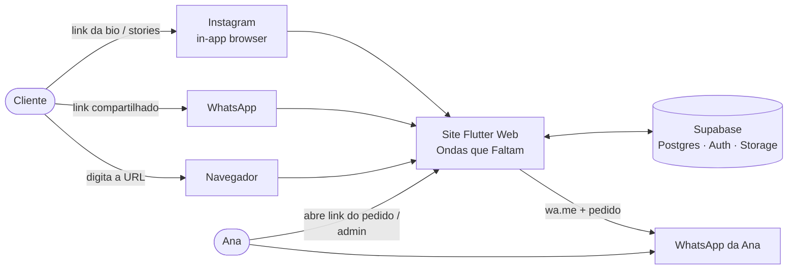

---

## 2. Personas e jornadas

| Persona | Contexto | Objetivo |
|---|---|---|
| **Cliente** | 90% no celular, vindo do Instagram; pouca paciência | Ver roupas, escolher tamanho/cor, mandar pedido rápido |
| **Ana (dona)** | Celular e às vezes notebook | Cadastrar peças, responder pedidos, baixar estoque, ver o que vende e de onde vêm os clientes |

### 2.1 Jornada do cliente

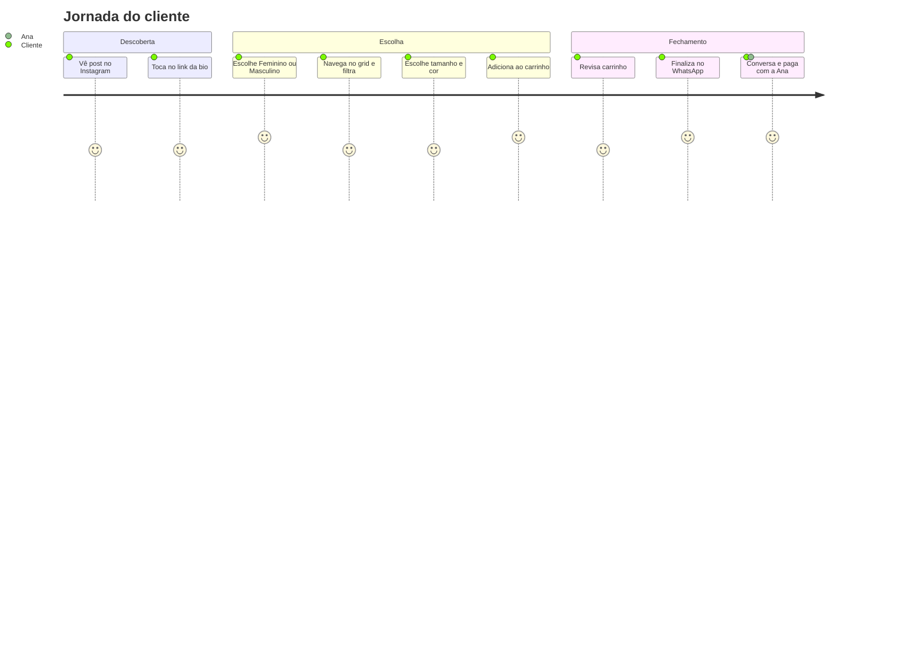

### 2.2 Jornada da Ana

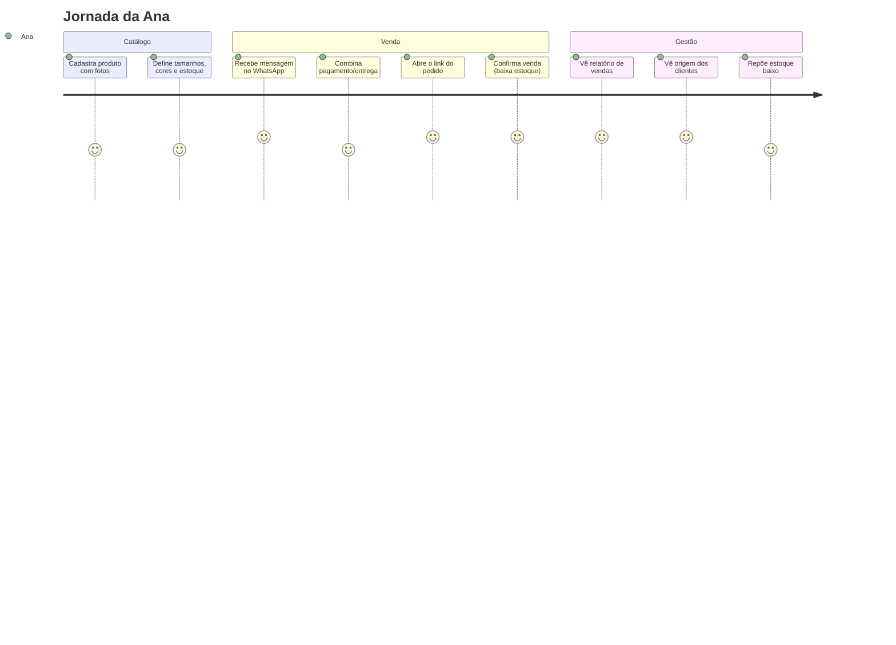

---

## 3. Requisitos funcionais

### 3.1 Vitrine (público)

| ID | Requisito | Prioridade |
|---|---|---|
| RF-01 | Landing com dois blocos grandes: **Feminino** e **Masculino** (+ destaques/novidades) | Must |
| RF-02 | Grid de produtos da seção escolhida, com imagem, nome, preço e selo (Novo / Últimas unidades / Esgotado) | Must |
| RF-03 | Filtros por categoria, tamanho, cor e ordenação (novidades, menor/maior preço) | Should |
| RF-04 | Detalhe do produto: galeria de imagens, descrição, seleção de **tamanho** e **cor**, quantidade (limitada ao estoque) | Must |
| RF-05 | Carrinho com uma ou mais peças; editar quantidade, remover; persistido no navegador | Must |
| RF-06 | Checkout: nome (opcional), observação (opcional) → cria pedido e abre o **WhatsApp da Ana** com a mensagem | Must |
| RF-07 | Página pública do pedido `/pedido/:code` (resumo e status) | Must |
| RF-08 | Alternar tema **claro/escuro/sistema** | Must |
| RF-09 | Captura da **origem** do acesso (ADR-0007) | Must |
| RF-10 | **Recado da loja** no topo (horário de entrega, pagamento), editável pela Ana | Must |
| RF-11 | **Preço promocional riscado** ("de / por") via `compare_at_price` | Must |
| RF-12 | **Observação por item** no carrinho, enviada na mensagem | Must |
| RF-13 | **"Avise-me"** em variante esgotada: abre o WhatsApp da Ana com a peça, o tamanho e a cor | Must |
| RF-14 | Checkout com **entrega (retirar / entregar)** e **forma de pagamento** (Pix / cartão / dinheiro), opcionais | Must |
| RF-15 | **Botão flutuante do WhatsApp** ("Falar com a vendedora") | Must |
| RF-16 | **Loja fechada temporariamente**: aviso na vitrine e checkout bloqueado | Must |

### 3.2 Admin (Ana)

| ID | Requisito | Prioridade |
|---|---|---|
| RF-20 | Login e-mail/senha; rotas `/admin/**` protegidas | Must |
| RF-21 | CRUD de produtos: nome, descrição, seção (masc/fem/unissex), categoria, preço, ativo | Must |
| RF-22 | Upload de **várias imagens** por produto, reordenar, definir capa (compressão no cliente) | Must |
| RF-23 | Variantes: combinação **tamanho × cor** (com hex da cor), estoque e preço opcional por variante | Must |
| RF-24 | Lista de pedidos com filtro por status, período e origem | Must |
| RF-25 | No link do pedido: **Confirmar venda** (baixa estoque), **Cancelar** (estorna se confirmado) | Must |
| RF-26 | Editar itens do pedido pendente (troca de tamanho/cor/qtd) | Could |
| RF-27 | **Controle de estoque:** visão por variante, ajuste manual (entrada/saída com motivo), alerta de estoque baixo | Must |
| RF-28 | Histórico de movimentações de estoque | Should |
| RF-29 | **Relatório de vendas:** faturamento, nº de vendas, ticket médio, por período; produtos mais vendidos | Must |
| RF-30 | **Relatório de origem:** visitas, pedidos e vendas por canal + taxa de conversão | Must |
| RF-31 | **Gerador de links** com `?src=` por canal (copiar) | Should |
| RF-32 | Configurações da loja: nome, número do WhatsApp, mensagem de saudação, limite de estoque baixo | Must |
| RF-33 | Exportar relatórios em CSV | Could |
| RF-34 | Compartilhar produto (link com `?src=`) | Could |
| RF-35 | Barra "faltam R$ X para frete grátis" (valor configurável) | Could |

---

## 4. Requisitos não funcionais

| ID | Requisito | Meta |
|---|---|---|
| RNF-01 | **Responsividade** do celular (360px) ao desktop (1920px) via `AppResponsive` | Todas as telas |
| RNF-02 | Primeiro carregamento no 4G | < 4 s até a landing interativa (splash HTML imediato) |
| RNF-03 | Funcionar no **in-app browser** do Instagram (iOS/Android) e no WhatsApp | Testado manualmente a cada release |
| RNF-04 | Acessibilidade: contraste AA, `Semantics` em botões e imagens | WCAG 2.1 AA |
| RNF-05 | Segurança: toda escrita sensível via RPC + RLS | 100% das tabelas com RLS ligado |
| RNF-06 | Consistência de estoque | Baixa transacional; nunca negativo (`check stock_qty >= 0`) |
| RNF-07 | Testabilidade | Domain + controllers ≥ 80% cobertura; RPCs com pgTAP |
| RNF-08 | Imagens | ≤ 300 KB cada após compressão; lazy loading no grid |
| RNF-09 | Privacidade | Nenhum dado pessoal em analytics (LGPD) |

---

## 5. Arquitetura

### 5.1 Visão de componentes

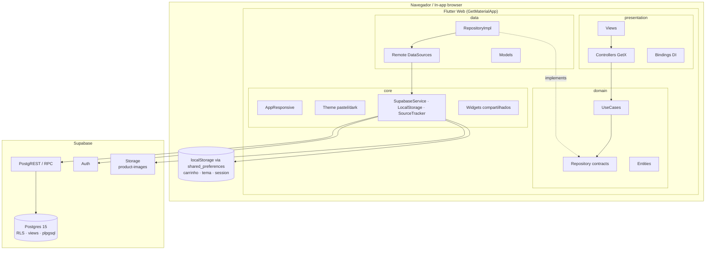

### 5.2 Clean Architecture + GetX (resumo)

- **Fluxo de chamada:** `View → Controller (GetX) → UseCase → Repository (contrato) ← RepositoryImpl → DataSource (Supabase)`.
- **DI:** `Binding` por rota registra `DataSource → Repository → UseCase → Controller` com `Get.lazyPut`.
  Serviços globais (`SupabaseService`, `LocalStorageService`, `ThemeController`, `CartController`, `SourceTracker`)
  no `InitialBinding` com `permanent: true`.
- **Estado:** `Rx<UiState<T>>` (`idle | loading | success | empty | failure`) observado com `Obx`.
- **Erros:** `Result<T>` (`Success`/`Failed(Failure)`) — exceções não chegam à View.

Detalhes: ADR-0003 e ADR-0004.

### 5.3 Pacotes previstos

| Pacote | Uso |
|---|---|
| `get` | Estado, DI, rotas, middlewares |
| `shared_preferences` | Persistência local (carrinho, tema, session) via `KeyValueStore` — compatível com `--wasm` |
| `supabase_flutter` | Banco, Auth, Storage |
| `url_launcher` | Abrir `wa.me` |
| `cached_network_image` | Imagens com cache/placeholder |
| `google_fonts` | Tipografia |
| `intl` | Moeda BRL, datas |
| `image_picker` + `image` | Upload e compressão de fotos (admin) |
| `fl_chart` | Gráficos dos relatórios |
| `uuid` | `session_id` |
| `equatable` | Igualdade em entities |
| *dev:* `flutter_test`, `mocktail`, `integration_test`, `flutter_lints`/`very_good_analysis` | Testes e lint |

---

## 6. Mapa de telas e rotas

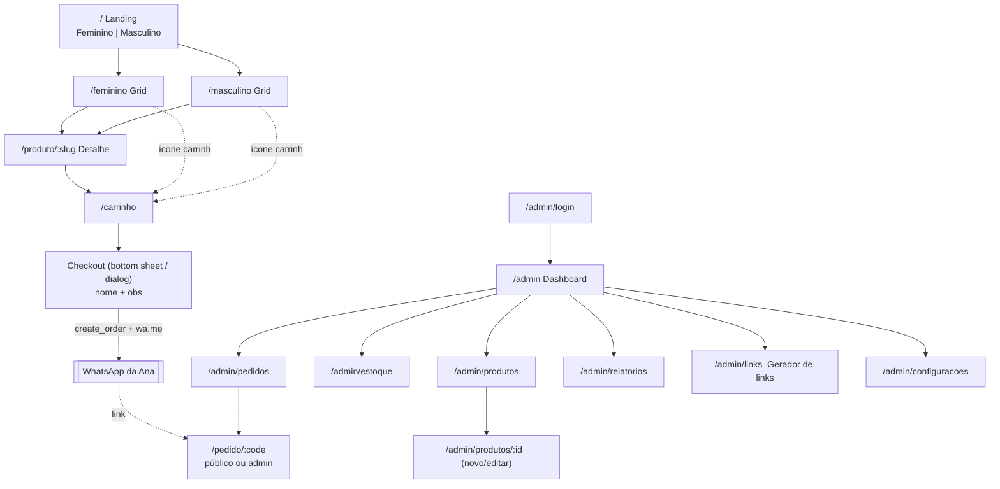

| Rota | Feature | Acesso | Binding |
|---|---|---|---|
| `/` | landing | público | `LandingBinding` |
| `/feminino`, `/masculino` | catalog | público | `CatalogBinding` (recebe `gender`) |
| `/produto/:slug` | product | público | `ProductBinding` |
| `/carrinho` | cart | público | (CartController global) + `CheckoutBinding` |
| `/pedido/:code` | order | público / admin | `OrderBinding` |
| `/admin/**` | admin/* (deferred) | admin (`AdminGuard`) | um binding por sub-feature |

---

## 7. Fluxos principais

### 7.1 Checkout via WhatsApp

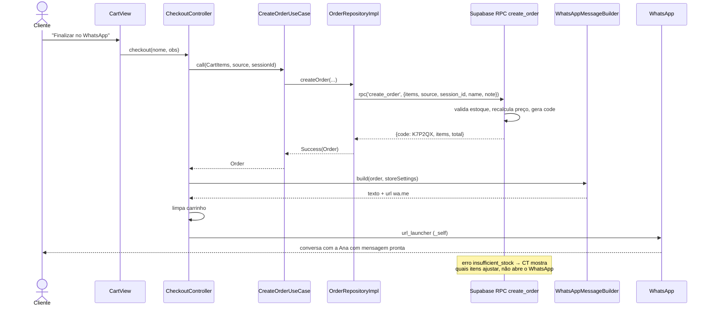

### 7.2 Confirmação da venda e baixa de estoque

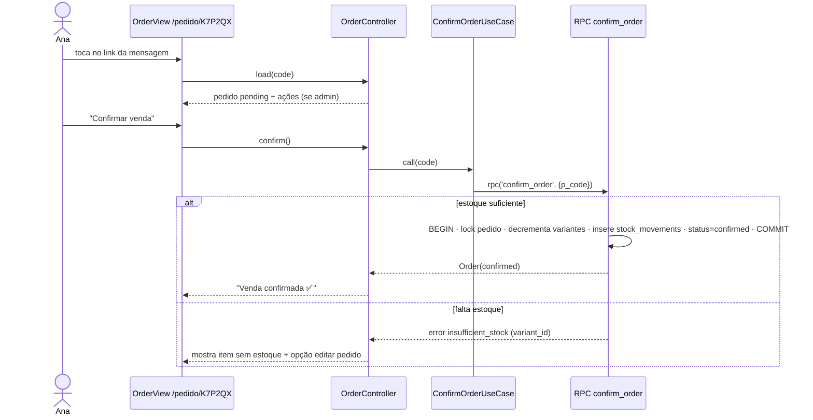

### 7.3 Cadastro de produto

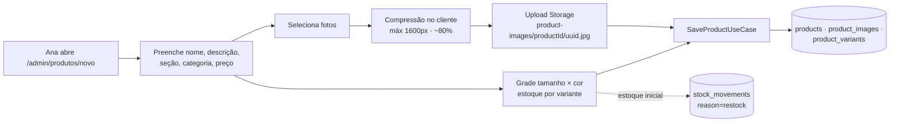

---

## 8. Modelo de dados

### 8.1 Diagrama ER

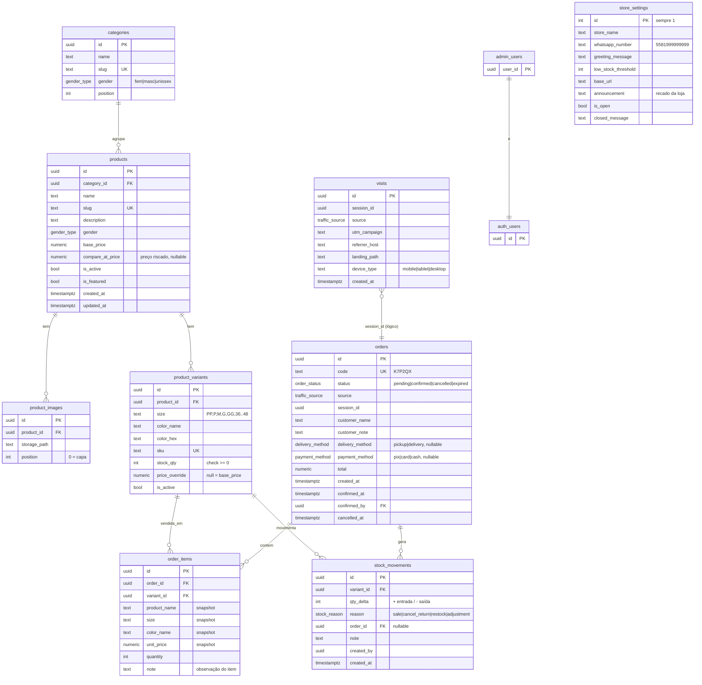

### 8.2 Enums

```sql
create type gender_type    as enum ('feminino', 'masculino', 'unissex');
create type order_status   as enum ('pending', 'confirmed', 'cancelled', 'expired');
create type traffic_source as enum ('instagram', 'whatsapp', 'facebook', 'busca', 'qrcode', 'site', 'outro');
create type stock_reason   as enum ('sale', 'cancel_return', 'restock', 'adjustment');
create type delivery_method as enum ('pickup', 'delivery');
create type payment_method  as enum ('pix', 'card', 'cash');
```

### 8.3 Decisões de modelagem

- **Snapshot em `order_items`** (nome, tamanho, cor, preço): se a Ana editar/remover o produto,
  o histórico de vendas não muda.
- **Estoque na variante**, não no produto: "Vestido M Rosa" é o que existe fisicamente.
  `unique (product_id, size, color_name)`.
- **`stock_movements` é o livro-razão**: `stock_qty` é o saldo atual; a soma dos movimentos deve
  bater com ele (teste pgTAP de consistência).
- Produto aparece em `/feminino` se `gender in ('feminino','unissex')` (idem masculino).
- **Soft delete** (`is_active = false`) para produtos com vendas.
- Índices: `products(gender, is_active)`, `orders(status, created_at)`, `orders(source)`,
  `visits(created_at, source)`, `stock_movements(variant_id, created_at)`.

### 8.4 Migrations (ordem)

| Arquivo | Conteúdo |
|---|---|
| `..._init_catalog.sql` | enums, `categories`, `products`, `product_images`, `product_variants`, triggers `updated_at` |
| `..._orders.sql` | `orders`, `order_items`, função `generate_order_code()` |
| `..._stock_movements.sql` | `stock_movements` |
| `..._visits_and_reports.sql` | `visits`, `store_settings`, views de relatório |
| `..._admin_and_rpcs.sql` | `admin_users`, `is_admin()`, RPCs |
| `..._rls_policies.sql` | `enable row level security` + policies |
| `..._storage_bucket.sql` | bucket `product-images` + policies de storage |

---

## 9. Segurança: RLS e RPCs

### 9.1 Matriz de acesso

| Tabela | `anon` (cliente) | `authenticated` + `is_admin()` |
|---|---|---|
| `categories`, `products`, `product_images`, `product_variants` | `select` onde `is_active` | CRUD |
| `orders`, `order_items` | ❌ (só via RPC) | `select`, `update` via RPC |
| `stock_movements` | ❌ | `select`, `insert` (ajuste manual via RPC) |
| `visits` | ❌ (só via RPC `track_visit`) | `select` |
| `store_settings` | `select` (nome, whatsapp, saudação) | `update` |
| `admin_users` | ❌ | `select` próprio |
| Storage `product-images` | leitura pública | upload/delete |

### 9.2 Contratos das RPCs

| RPC | Quem | Entrada | Saída | Regras |
|---|---|---|---|---|
| `create_order` | anon | `items jsonb [{variant_id, quantity}]`, `source`, `session_id`, `customer_name?`, `customer_note?` | `{code, total, items[]}` | 1–20 itens; qtd 1–10; variante ativa; `stock_qty >= qtd`; preço do banco; rate limit 5/h por `session_id` |
| `get_order_public` | anon | `p_code` | itens, total, status, created_at | Sem `session_id`, sem `confirmed_by` |
| `confirm_order` | admin | `p_code` | order | `pending` → `confirmed`; baixa atômica; erro `insufficient_stock` |
| `cancel_order` | admin | `p_code`, `p_reason?` | order | `confirmed` estorna estoque |
| `adjust_stock` | admin | `variant_id`, `qty_delta`, `reason`, `note` | saldo | Não deixa negativo |
| `track_visit` | anon | `session_id`, `source`, `utm_campaign?`, `referrer_host?`, `landing_path`, `device_type` | void | 1 por sessão (`on conflict do nothing`) |

### 9.3 Esboço — `confirm_order`

```sql
create or replace function public.confirm_order(p_code text)
returns public.orders
language plpgsql
security definer
set search_path = public
as $$
declare
  v_order public.orders;
  v_item  record;
begin
  if not public.is_admin() then
    raise exception 'forbidden' using errcode = '42501';
  end if;

  select * into v_order from public.orders where code = p_code for update;
  if not found then raise exception 'order_not_found'; end if;
  if v_order.status <> 'pending' then raise exception 'order_not_pending'; end if;

  for v_item in select variant_id, quantity from public.order_items where order_id = v_order.id loop
    update public.product_variants
       set stock_qty = stock_qty - v_item.quantity
     where id = v_item.variant_id and stock_qty >= v_item.quantity;
    if not found then
      raise exception 'insufficient_stock' using detail = v_item.variant_id::text;
    end if;

    insert into public.stock_movements (variant_id, qty_delta, reason, order_id, created_by)
    values (v_item.variant_id, -v_item.quantity, 'sale', v_order.id, auth.uid());
  end loop;

  update public.orders
     set status = 'confirmed', confirmed_at = now(), confirmed_by = auth.uid()
   where id = v_order.id
  returning * into v_order;

  return v_order;
end;
$$;
```

> Boa prática: toda função `security definer` com `set search_path` fixo e checagem explícita de
> permissão; `revoke execute ... from anon` nas RPCs de admin.

---

## 10. Origem do tráfego e relatórios

### 10.1 Captura
Ver ADR-0007. `SourceTracker` roda no `InitialBinding`, resolve a origem **uma vez por sessão**,
salva no `KeyValueStore` e chama `track_visit`. `create_order` recebe a mesma `source`.

### 10.2 Views de relatório

| View | Colunas | Alimenta |
|---|---|---|
| `v_sales_daily` | dia, nº vendas, faturamento, ticket médio | Gráfico de linha + KPIs |
| `v_sales_by_source` | source, visitas, pedidos, vendas, faturamento, conversão % | "De onde vêm meus clientes" |
| `v_top_products` | produto, qtd vendida, faturamento | Ranking |
| `v_sales_by_gender` | gender, vendas, faturamento | Masc × Fem |
| `v_stock_overview` | produto, variante, saldo, abaixo do limite? | Tela de estoque |
| `v_pending_orders_age` | pedido, dias pendente | Lembrete de follow-up |

Views com `security_invoker = true` para respeitar o RLS. Filtro de período via RPC
`report_sales(p_from, p_to)` quando precisar de parâmetro.

### 10.3 Dashboard (layout)

```
┌───────────────────────────────────────────────────────────────┐
│  Período: [Últimos 30 dias ▾]                                  │
├──────────────┬──────────────┬──────────────┬──────────────────┤
│ Faturamento  │ Vendas       │ Ticket médio │ Pedidos pendentes │
│ R$ 4.380,00  │ 27           │ R$ 162,22    │ 5                 │
├──────────────┴──────────────┴──────────────┴──────────────────┤
│ Vendas por dia (linha)                                         │
├───────────────────────────────┬───────────────────────────────┤
│ Origem dos clientes (barras)  │ Mais vendidos (top 5)          │
│ Instagram ████████ 62%        │ 1. Vestido Midi  ·  9          │
│ WhatsApp  ████ 28%            │ 2. Camisa Oxford ·  6          │
│ Site      ██ 10%              │ ...                            │
├───────────────────────────────┴───────────────────────────────┤
│ ⚠ Estoque baixo: 4 variantes  [ver]                            │
└───────────────────────────────────────────────────────────────┘
```
No mobile os cards ficam em 2×2 e os blocos empilham (via `AppResponsive`).

---

## 11. Front-end: features, use cases e controllers

| Feature | Use cases | Controller(s) | Repositório |
|---|---|---|---|
| landing | `GetFeaturedProducts` | `LandingController` | `ProductRepository` |
| catalog | `GetProductsByGender`, `GetCategories` | `CatalogController` (filtros `Rx`) | `ProductRepository`, `CategoryRepository` |
| product | `GetProductBySlug` | `ProductDetailController` (tamanho/cor/qtd selecionados) | `ProductRepository` |
| cart | `AddToCart`, `UpdateCartItem`, `RemoveFromCart`, `GetCart`, `ClearCart` | `CartController` (**global**) | `CartRepository` (local – `KeyValueStore`) |
| checkout | `CreateOrder`, `BuildWhatsAppMessage`, `GetStoreSettings` | `CheckoutController` | `OrderRepository`, `SettingsRepository` |
| order | `GetOrderPublic`, `ConfirmOrder`, `CancelOrder`, `UpdateOrderItems` | `OrderController` | `OrderRepository` |
| admin/auth | `SignIn`, `SignOut`, `GetCurrentAdmin` | `AuthController` (global) | `AuthRepository` |
| admin/products | `ListProducts`, `SaveProduct`, `UploadProductImage`, `DeleteProductImage`, `ToggleProductActive` | `AdminProductsController`, `ProductFormController` | `AdminProductRepository`, `ImageRepository` |
| admin/stock | `GetStockOverview`, `AdjustStock`, `GetStockMovements` | `StockController` | `StockRepository` |
| admin/orders | `ListOrders` | `AdminOrdersController` | `OrderRepository` |
| admin/reports | `GetSalesReport`, `GetSourceReport`, `GetTopProducts` | `ReportsController` | `ReportRepository` |
| admin/settings | `GetStoreSettings`, `UpdateStoreSettings`, `BuildTrackingLinks` | `SettingsController` | `SettingsRepository` |

### 11.1 Componentes compartilhados previstos (`core/widgets`)

`ResponsivePage`, `AppHeader`, `CartBadgeButton`, `ProductCard`, `ProductGrid`, `PriceText`,
`StockBadge`, `SizeSelector`, `ColorSelector`, `QuantityStepper`, `AppButton`, `EmptyState`,
`ErrorState`, `LoadingSkeleton`, `ThemeToggle`, `KpiCard`, `ConfirmDialog`.

> Regra: **antes de criar** qualquer widget novo, procurar aqui. Widget usado em 2+ features sobe para `core/widgets`.

---

## 12. Design system e responsividade

- **Cores, tipografia, tema escuro:** ADR-0009 (`core/theme/`). Sem Figma: a paleta evolui a partir das referências visuais.
- **Responsividade:** ADR-0010 — `AppResponsive` (`context.responsive`) + `ResponsivePage` em **todas** as telas.

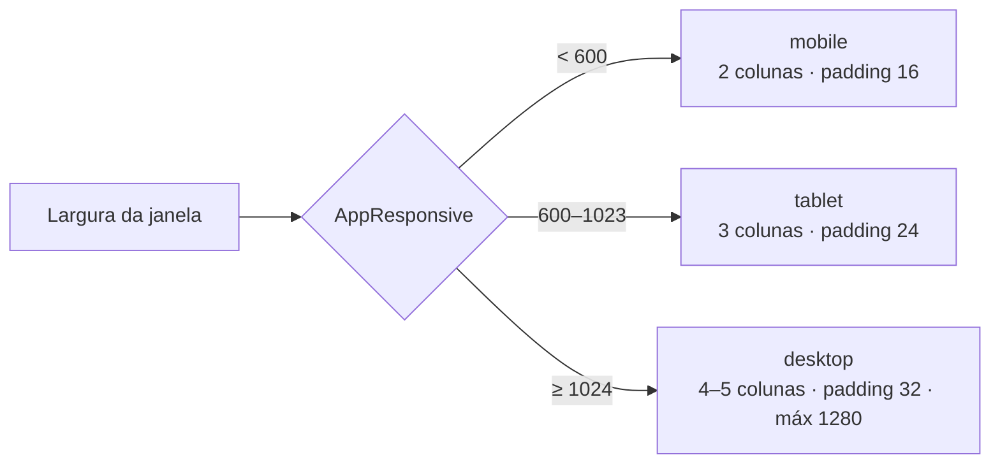

| Tela | Mobile | Desktop |
|---|---|---|
| Landing | Blocos Fem/Masc empilhados (50% altura cada) | Lado a lado, imagem grande |
| Grid | 2 colunas, filtros em bottom sheet | 4–5 colunas, filtros em sidebar |
| Detalhe | Galeria em carrossel, botão fixo no rodapé | Galeria à esquerda, info à direita |
| Carrinho | Lista + botão fixo "Finalizar no WhatsApp" | Lista + resumo lateral |
| Admin | Drawer + cards empilhados | NavigationRail + tabelas |

---

## 13. Estratégia de testes

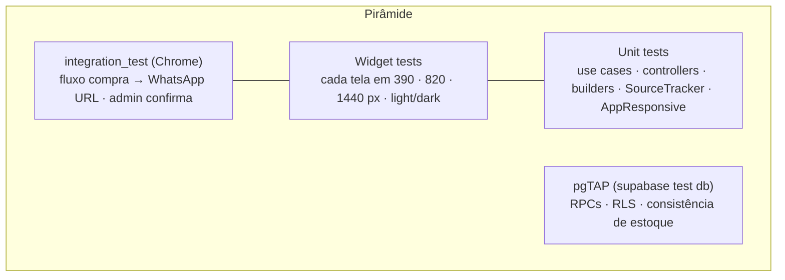

| Alvo | Casos-chave |
|---|---|
| `WhatsAppMessageBuilder` | formato, moeda BRL, encode de emoji/acentos, link do pedido |
| `SourceTracker` | prioridade `src` > UA > referrer; first-touch não sobrescreve |
| `CartController` | somar mesma variante, limite de estoque, persistência |
| `AppResponsive` | breakpoints exatos (599/600, 1023/1024), `value()` com herança |
| `create_order` | preço do banco, estoque insuficiente, rate limit, anon não lê `orders` |
| `confirm_order` | idempotência, rollback parcial, não-admin bloqueado, movimentos gerados |
| `cancel_order` | estorno só se `confirmed` |
| RLS | anon não vê produto inativo; anon não faz `insert` em `orders` |

Regra do projeto: **nada sobe sem teste** sem alinhamento prévio.

---

## 14. Ambientes, configuração e comandos

### 14.1 Variáveis (`--dart-define`)

| Variável | Local | Produção |
|---|---|---|
| `SUPABASE_URL` | `http://127.0.0.1:54321` | `https://<ref>.supabase.co` |
| `SUPABASE_ANON_KEY` | exibida no `supabase start` | painel do Supabase |
| `APP_BASE_URL` | `http://localhost:8080` | domínio final |

Arquivos `env/local.json` / `env/prod.json` com `--dart-define-from-file` (prod **fora do git**).

### 14.2 Comandos

```bash
# Banco local (Docker precisa estar rodando)
supabase start
supabase db reset          # aplica migrations + seed (mock)
supabase test db           # pgTAP

# App
flutter run -d chrome --web-port 8080 --dart-define-from-file=env/local.json
flutter test
flutter build web --release --wasm --dart-define-from-file=env/prod.json

# Publicar schema na nuvem
supabase link --project-ref <ref>
supabase db push
```

### 14.3 Estrutura do repositório

```
lojajoyjoy/
├── CLAUDE.md
├── docs/
│   ├── adr/
│   └── sdd/SDD.md
├── supabase/               # migrations, seed, tests (ADR-0008)
├── lib/                    # Clean Architecture (ADR-0004)
├── test/                   # espelha lib/
├── integration_test/
├── web/                    # index.html (splash + Open Graph), manifest, ícones
├── env/                    # local.json (dev), prod.json (ignorado)
└── vercel.json             # quando ADR-0012 for aceito
```

---

## 15. LGPD e privacidade

- Cliente **não cria conta**; nome é opcional e só fica no pedido.
- Telefone do cliente **não é coletado** pelo site (já fica no WhatsApp da Ana).
- `visits` guarda apenas `session_id` anônimo, origem, host do referrer e tipo de dispositivo — sem IP, sem UA completo.
- Página simples de **Política de Privacidade** linkada no rodapé.

---

## 16. Roadmap

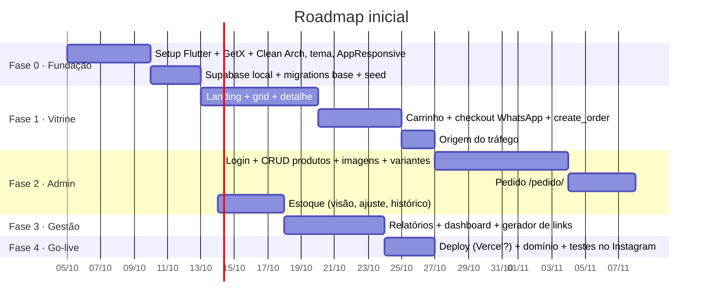

**MVP para a Ana começar a usar:** Fases 0–2 (vitrine + checkout + admin de produtos + baixa de estoque).

---

## 17. Riscos e questões em aberto

### 17.1 Riscos

| Risco | Impacto | Mitigação |
|---|---|---|
| First-load pesado do Flutter Web no Instagram | Cliente desiste | Splash HTML, `--wasm`, deferred admin, imagens leves |
| Supabase free pausa por inatividade | Site fora do ar | Plano Pro em produção ou ping agendado |
| Pedidos abandonados / spam | Relatório poluído | Status `expired`, rate limit, filtros |
| GetX com manutenção irregular | Débito técnico | GetX isolado em presentation/bindings (Clean Arch) |
| Sem Figma | Retrabalho visual | Referências no início + tokens centralizados; só `core/theme` muda |

### 17.2 Questões em aberto

- [x] **Número do WhatsApp da Ana:** `5581986323686` (em `store_settings`).
- [ ] **Domínio** (ex.: `ondasquefaltam.com.br`) e hospedagem final (ADR-0012).
- [ ] **Tabela de tamanhos**: letras (PP–GG), numeração (36–48) ou ambos? Por categoria?
- [x] **Figma:** não teremos. Design a partir de lojas de referência (`docs/design/referencias.md`).
- [x] **Logo** da Ana: aplicada (`assets/brand/logo.png`, `web/icons/`).
- [ ] Mostrar **quantidade em estoque** ao cliente ou só "Últimas unidades"?
- [ ] Pedidos pendentes expiram em quantos dias?
- [ ] Haverá mais de uma pessoa no admin?
- [ ] Integrar Meta Pixel / GA no futuro (exige banner de cookies)?
